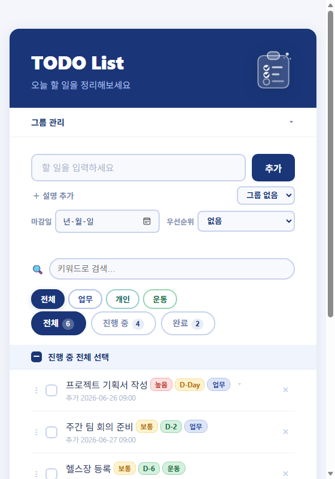
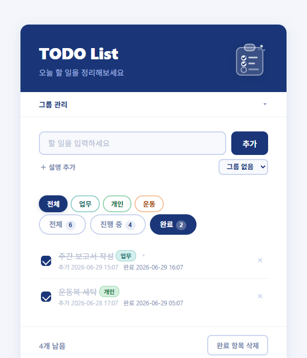
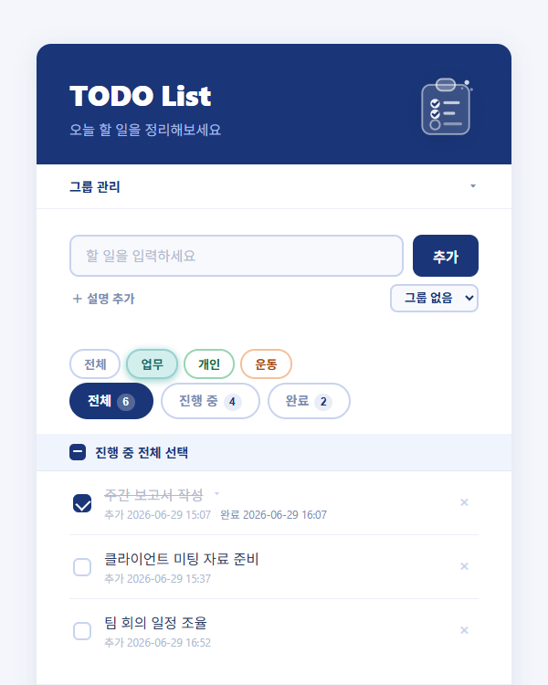
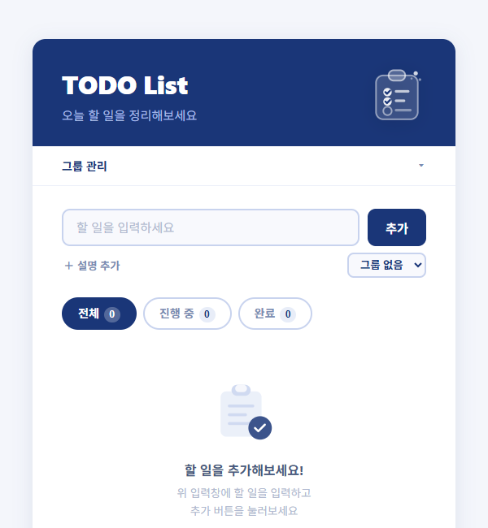

# TODO List

오늘 할 일을 간편하게 관리하는 순수 HTML/CSS/JS 기반의 할 일 관리 앱입니다.
별도 설치 없이 브라우저에서 바로 실행됩니다.
branch test 중입니다.

<br>

## 스크린샷

| 메인 화면 | 완료 항목 보기 |
|:---------:|:--------------:|
|  |  |

| 그룹 필터 | 빈 화면 |
|:---------:|:-------:|
|  |  |

<br>

## 주요 기능

### 할 일 관리
- **추가** — 입력창에 텍스트 입력 후 `추가` 버튼 또는 `Enter` 키로 등록
- **설명 추가** — `+ 설명 추가` 버튼으로 세부 설명 입력 (접기/펼치기)
- **완료 처리** — 체크박스 클릭 시 취소선 표시 및 완료 시간 자동 기록
- **시간 기록** — 추가 시간 및 완료 시간을 `연-월-일 시:분` 형식으로 표시
- **개별 삭제** — 각 항목 우측 `×` 버튼으로 삭제

### 필터 & 뷰
- **상태 탭** — 전체 / 진행 중 / 완료 탭 전환, 각 탭에 항목 수 뱃지 표시
- **그룹 필터** — 그룹별로 필터링하여 보기 (상태 탭과 AND 조건으로 동시 적용)
- **전체 선택** — 진행 중 항목을 한 번에 완료 처리 (부분 완료 시 중간 상태 표시)

### 그룹 관리
- **그룹 생성** — 자유롭게 그룹 이름 지정 (업무, 개인, 운동 등)
- **그룹 색상** — 그룹마다 8가지 색상 팔레트 자동 적용으로 시각적 구분
- **그룹 지정** — 할 일 추가 시 드롭다운으로 그룹 선택
- **그룹 삭제** — 그룹 삭제 시 해당 그룹의 할 일은 '그룹 없음'으로 처리

### UX
- **빈 화면 안내** — 항목이 없을 때 일러스트와 안내 문구 표시
- **완료 항목 일괄 삭제** — 하단 버튼으로 완료된 항목 한 번에 삭제
- **남은 개수 표시** — 진행 중인 항목 수를 하단에 실시간 표시

<br>

## 사용 방법

별도의 설치나 빌드 없이 `index.html`을 브라우저에서 바로 열어 사용합니다.

```
todo-list/
├── index.html      # 마크업 구조
├── style.css       # 스타일
├── script.js       # 기능 로직
└── assets/         # 스크린샷 이미지
```

<br>

## 기술 스택


- **HTML5** — 시맨틱 마크업
- **CSS3** — Flexbox 레이아웃, 커스텀 체크박스, CSS 트랜지션
- **JavaScript (Vanilla)** — 외부 라이브러리 없이 순수 JS로 구현
